## C-pandas-dataframes

## ¿Que es pandas ?


Pandas es una biblioteca de código abierto que se basa en otra librería de Python llamada NumPy. Su propósito es facilitar el trabajo con datos estructurados, como tablas y series de tiempo, de una manera rápida, intuitiva y flexible. Su nombre proviene de "Panel Data", un término que se usa para describir datos bidimensionales en econometría.

En Python, para poder utilizar la librería pandas primero se debe importar en el código. La forma más común y recomendada es usando un alias corto, generalmente pd, lo cual facilita su escritura en los comandos posteriores. Por ejemplo:

```python
import pandas as pd
```


| **Comando** |**Definición** | **Ejecución** |
|-------------|----------------|-------------------------|
| `pd.DataFrame()` | Genera una tabla bidimensional de datos organizada en filas y columnas. Se puede crear a partir de diccionarios, listas, arreglos o incluso otros DataFrames.| 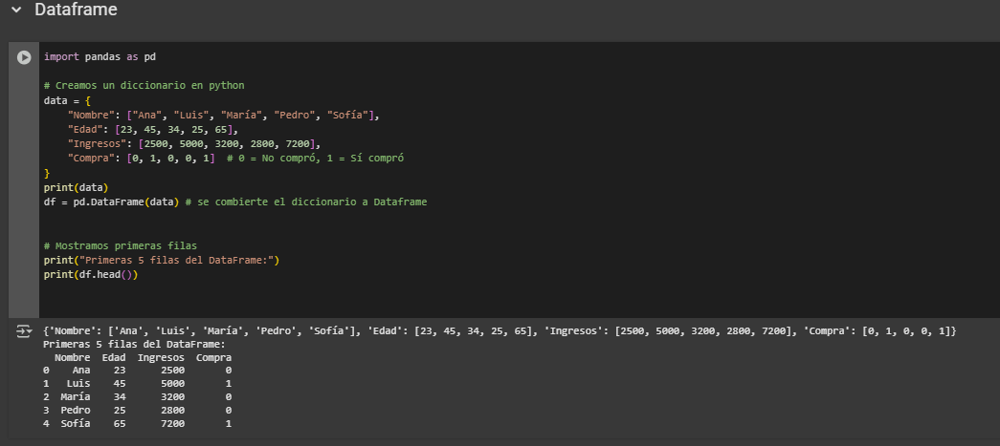 | 
| `pd.Series()` | Crea una estructura unidimensional similar a un arreglo de NumPy, pero con índices personalizados, lo que permite identificar cada valor fácilmente. |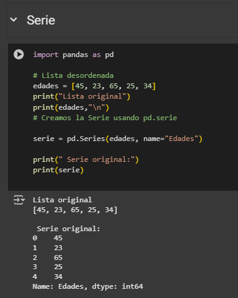|
| `.head(n)` | Muestra las primeras **n** filas de un DataFrame o Serie. Es útil para revisar rápidamente cómo están organizados los datos. |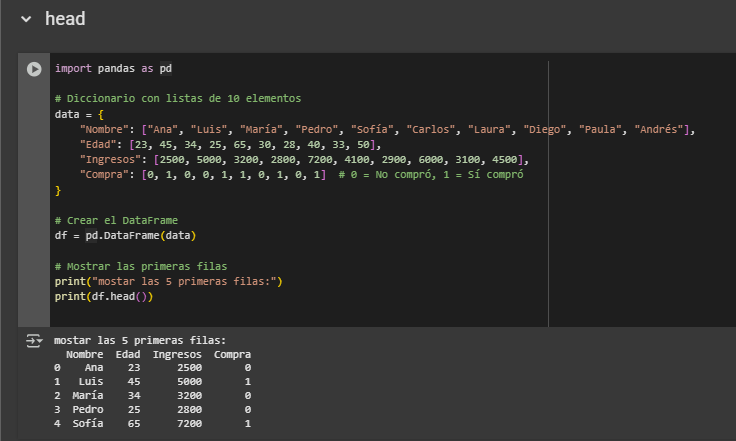|
| `.dtypes` | Devuelve el tipo de dato de cada columna dentro del DataFrame (por ejemplo, int64, float64, object). |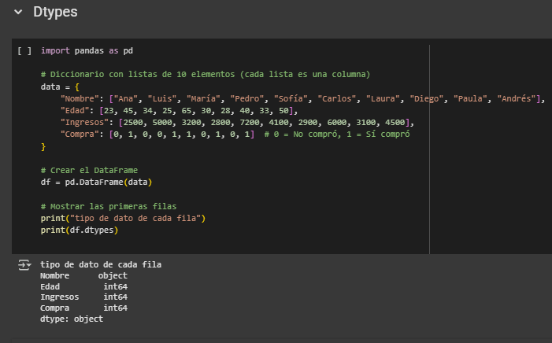  |
 `df['columna']` | Permite seleccionar una columna específica del DataFrame y devolverla como un objeto Series. Es la forma más común de acceder a un conjunto de datos dentro de la tabla. |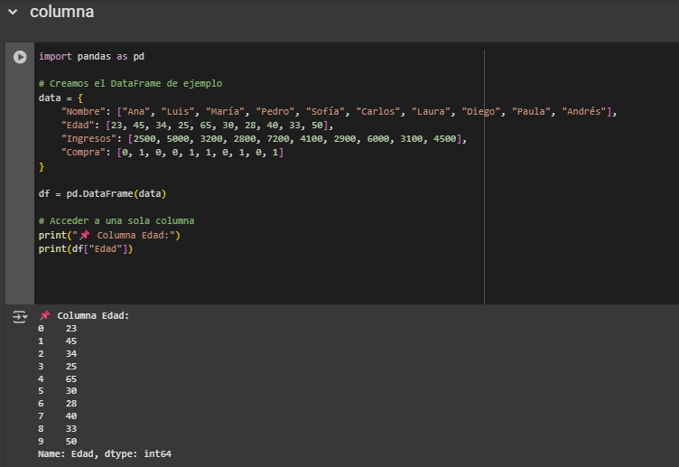|
  `pd.read_csv('arch.csv')` |Es un archivo de texto donde los datos están organizados en filas y columnas, y cada valor está separado por comas (o punto y coma en algunos casos). Es uno de los formatos más comunes para guardar y compartir datos|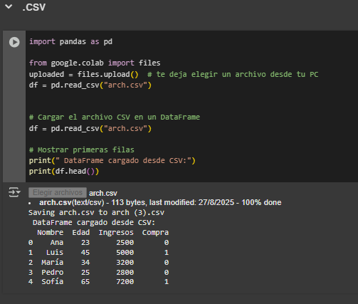|
  | `.tail(n)` | Muestra las últimas **n** filas de un DataFrame o Serie. | 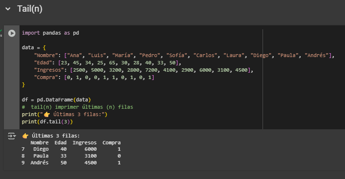 |
| `.info()` | Da un resumen del DataFrame: número de filas, columnas, tipos de datos y valores nulos. | 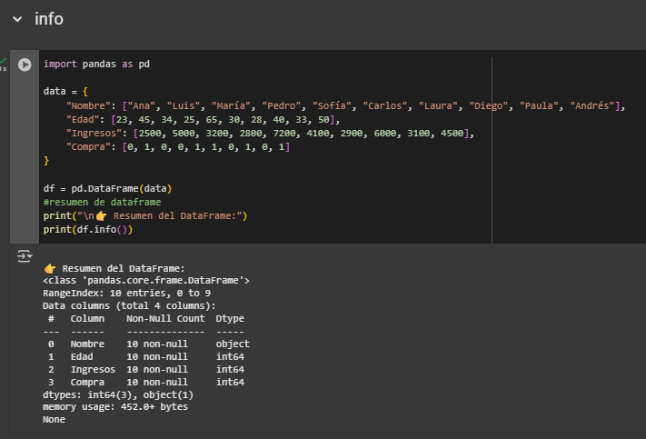 |
| `.describe()` | Calcula estadísticas básicas (media, desviación estándar, mínimo, máximo, cuartiles) de las columnas numéricas. | 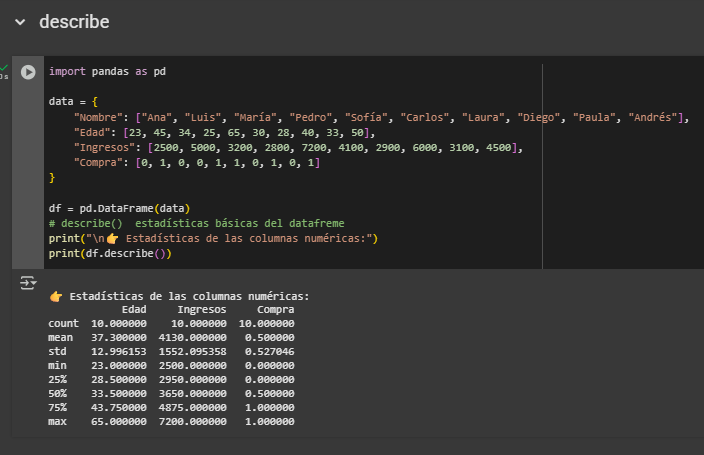 |
| `.sort_values('columna')` | Ordena el DataFrame según los valores de una columna (ascendente o descendente). | 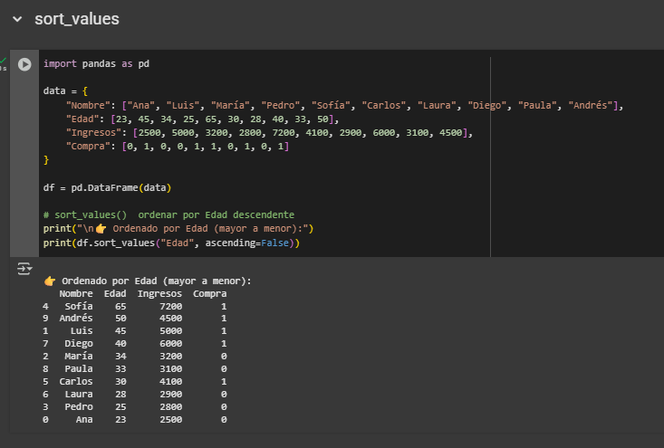 |
| `.iloc[]` | Selección de filas/columnas por **posición numérica**. | 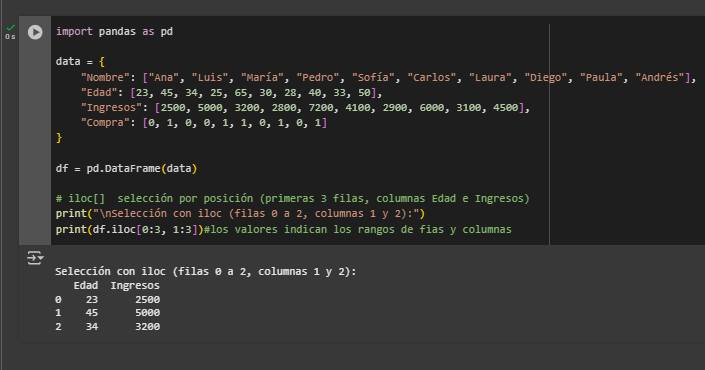 |


   