# Métodos NumPy y Pandas

## Introducción

### Numpy

Según la documentación oficial de NumPy (numpy.org) es una librería fundamental para ciencia de datos en Python, en el core de la librería se encuentran los objetos `ndarray` permitiéndonos encapsular un array de n-dimensiones con datos del mismo tipo, permitiendo realizar múltiples operaciones matemáticas y algoritmicas.

La documentación nos indica que una de las razones por las que NumPy existe es para optimizar la ejecución de código para este tipo de operaciones, exponiendo el siguiente ejemplo:

```python
# Este codigo en python multiplica dos array de una dimensión

c = []
for i in range(len(a)):
    c.append(a[i]*b[i])

# A pesar de producir el resultado esperado, en el caso de que los arrays
# contengan millones de datos, empezaremos a tener problemas de rendimiento
```

para resolver esto resultaría más eficiente realizando el código en C, ayudándonos a obtener rendimiento, sin embargo perdemos la flexibilidad que nos ofrece Python con su sintaxis, es acá entonces donde entra NumPy, dándonos el siguiente resultado:

```python
c = a * b
```

Como se mencionó anteriormente, una de las cosas que hace a NumPy interesante es el trabajo detrás que realiza para obtener resultados eficientes de operaciones entre diferentes arrays, operaciones aritméticas, de la misma o diferente forma, escalares, etc. Además de que ofrece otras herramientas, como el _sorting_, _Discrete Fourier Transforms_, Álgebra Lineal básica, estadística y demás posibilidades.

### Pandas

Pandas es una librería open-source de Python, hecha para manejar datos tabulados y así poder realizar análisis con dichos datos, según MLJAR (s.f.) define dos estructuras esenciales:

- **Series:** un arreglo unidimensional con etiquetas (índice) que puede contener distintos tipos de datos.

- **DataFrame:** una estructura bidimensional que permite almacenar columnas de diferentes tipos, indexadas y manipulables de forma eficiente

Algunas de sus características principales que hacen relevante a pandas son:

- Permite hacer lectura y escribe de varios formatos de archivos: CSV, Excel, SQL, JSON, etc.

- Tiene funciones que permiten reordenar, agrupar y fusionar datos

- Permite generar series temporales para análisis, temas como generación de rangos de fechas por ejemplo

- Para manejar eficiencia y optimización algunas de sus partes están escritas en C

Un ejemplo básico que podemos encontrar es lo siguiente:

```python
import pandas as pd
df = pd.read_csv('archivo.csv')
pd.Series([1, 2, 3], index=['a', 'b', 'c'])
pd.DataFrame({'col1': [1,2], 'col2': [3,4]})
```

Esta librería se integra muy bien con otras librerías, como NumPy, Matplotlib, SciPy, scikit-learn, etc.

## A. NumPy - Creación y manipulación de arreglos

| Comando | Definición | Ejecución |
|:--------------:|:------------:|:-------------:|
| `np.array()` | Te permite crear arrays directamente de tuplas o listas |  |
| `np.zeros()` y `np.ones()` | Crean arrays multidimensionales de 0s y 1s |  |
| `np.reshape()` | Cambia la forma del array sin cambiar sus datos |  |
| `np.concatenate()` | Unir dos o más arrays en uno solo | 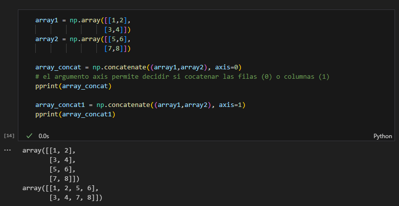 |
| `np.vstack()` | Concatena arrays verticalmente (uno debajo del otro) | 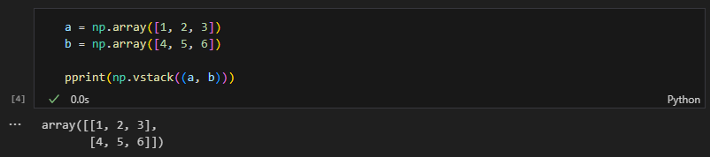 |
| `np.hstack()` | Concatena arrays horizontalmente (uno al lado del otro) | 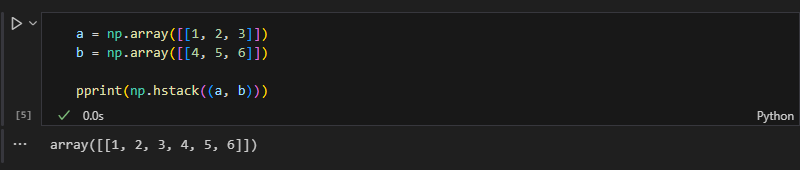 |
| `np.split()` | Divide un array en varios sub-arrays | 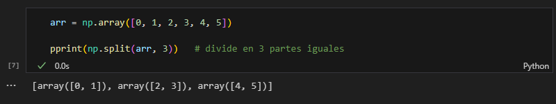 |
| `np.ravel()` | Aplana el array a 1 dimensión, no modifica el original | 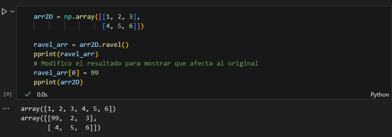 |
| `np.flatten()` | Aplana el array a 1 dimensión, pero devuelve una copia independiente del array original | 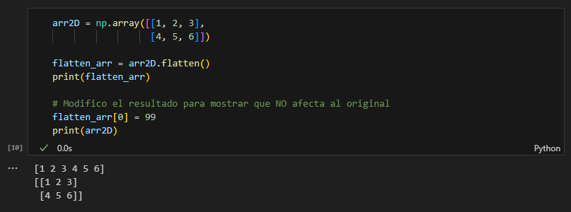 |
| `+` | Suma elemento a elemento de dos arrays | 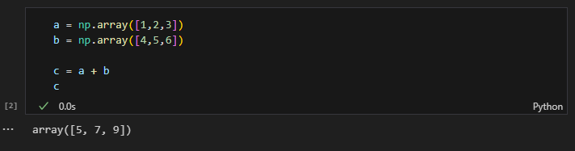 |
| `-` | Resta elemento a elemento de dos arrays | 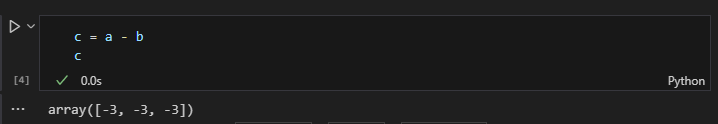 |
| `*` | Multiplica elemento a elemento de dos arrays | 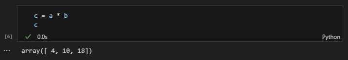 |
| `/` | Divide elemento a elemento de dos arrays | 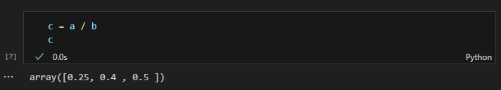 |
| `**` | Eleva a potencia elemento a elemento de dos arrays | 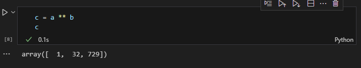 |

## B. NumPy - Operaciones estadísticas y funciones avanzadas

| Comando | Definición | Ejecución |
|:--------------:|:------------:|:-------------:|
| `np.mean()` | Calcula el promedio (media aritmética) de los elementos de un array | 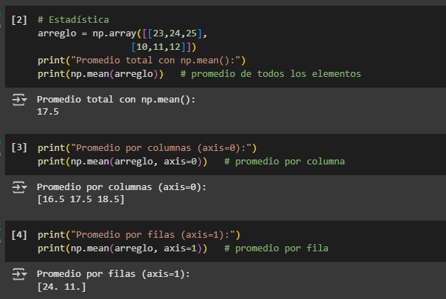 |
| `np.std()` | Calcula la desviación estándar, medida de la dispersión de los datos | 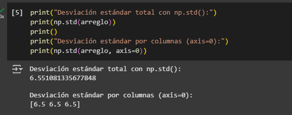 |
| `np.sum()` | Devuelve la suma de todos los elementos del array (puede ser por filas/columnas) | 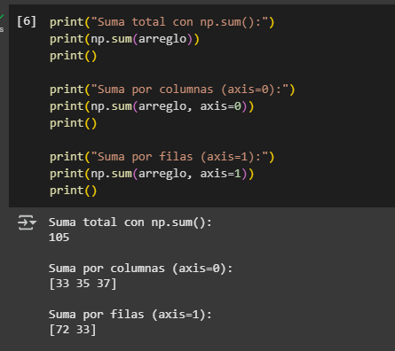 |
| `np.arange()` | Genera un array con valores en un rango definido, usando un paso específico | 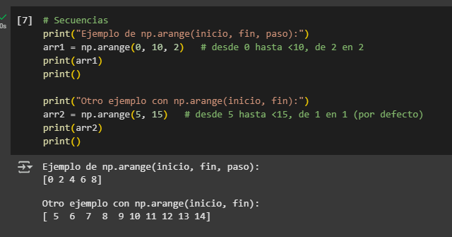 |
| `np.linspace()` | Genera un array con un número fijo de valores equiespaciados en un intervalo| 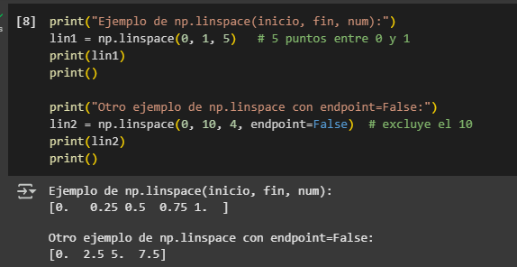 |
| `np.random.rand()` | Genera números aleatorios con distribución uniforme en el rango [0, 1) | 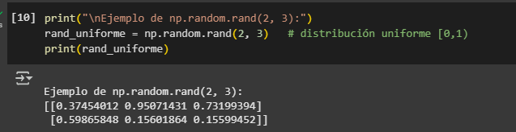 |
| `np.random.randn()` | Genera números aleatorios con distribución normal estándar (media 0, varianza 1) | 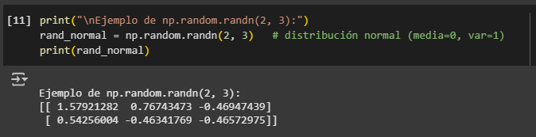 |
| `np.random.randint()` | Genera enteros aleatorios dentro de un rango definido | 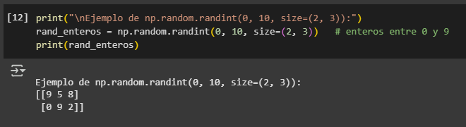 |
| `np.random.seed()` | Fija la semilla para que los números aleatorios sean reproducibles | 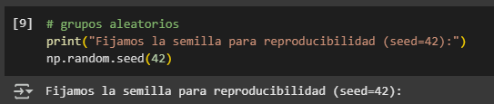 |
| `np.dot()` | Calcula el producto escalar o multiplicación de matrices | 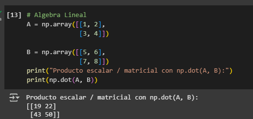 |
| `np.matmul()` / `@` | Multiplicación matricial (equivalente a `np.dot` en 2D, pero más general) | 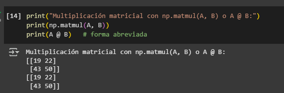 |
| `np.linalg.det()` | Devuelve el determinante de una matriz |   |
| `np.linalg.inv()` | Calcula la matriz inversa (si existe) | 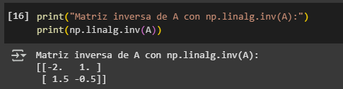 |
| `np.linalg.eig()` | Obtiene los autovalores y autovectores de una matriz cuadrada | 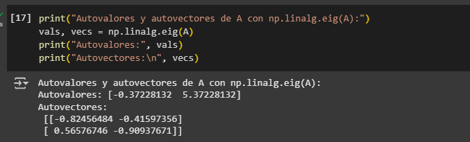 |
| `np.linalg.solve()` | Resuelve un sistema de ecuaciones lineales de la forma Ax = b | 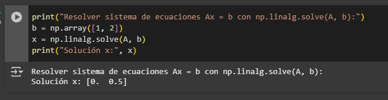 |

## Referencias

- NumPy.org. (s.f.). _NumPy Documentation_. <https://numpy.org/doc/stable/index.html>
- Pandas.org. (s.f.). _Pandas Documentation_. <https://pandas.pydata.org/docs/>
