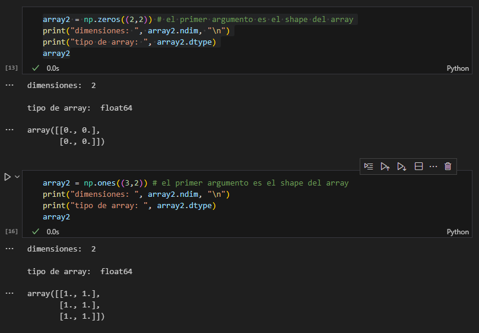

# Métodos NumPy y Pandas

## Introducción

### Numpy

Según la documentación oficial de NumPy (numpy.org) es una librería fundamental para ciencia de datos en Python, en el core de la librería se encuentran los objetos `ndarray` permitiéndonos encapsular un array de n-dimensiones con datos del mismo tipo, permitiendo realizar múltiples operaciones matemáticas y algoritmicas.

La documentación nos indica que una de las razones por las que NumPy existe es para optimizar la ejecución de código para este tipo de operaciones, exponiendo el siguiente ejemplo:

```python
# Este codigo en python multiplica dos array de una dimensión

c = []
for i in range(len(a)):
    c.append(a[i]*b[i])

# A pesar de producir el resultado esperado, en el caso de que los arrays
# contengan millones de datos, empezaremos a tener problemas de rendimiento
```

para resolver esto resultaría más eficiente realizando el código en C, ayudándonos a obtener rendimiento, sin embargo perdemos la flexibilidad que nos ofrece Python con su sintaxis, es acá entonces donde entra NumPy, dándonos el siguiente resultado:

```python
c = a * b
```

Como se mencionó anteriormente, una de las cosas que hace a NumPy interesante es el trabajo detrás que realiza para obtener resultados eficientes de operaciones entre diferentes arrays, operaciones aritméticas, de la misma o diferente forma, escalares, etc. Además de que ofrece otras herramientas, como el _sorting_, _Discrete Fourier Transforms_, Álgebra Lineal básica, estadística y demás posibilidades.

### Pandas

aaaaa

## A. NumPy - Creación y manipulación de arreglos

| Comando | Definición | Ejecución |
|:--------------:|:------------:|:-------------:|
| `np.array()` | Te permite crear arrays directamente de tuplas o listas |  |
| `np.zeros()` y `np.ones()` | Crean arrays multidimensionales de 0s y 1s |  |
| `np.reshape()` | Cambia la forma del array sin cambiar sus datos |  |
